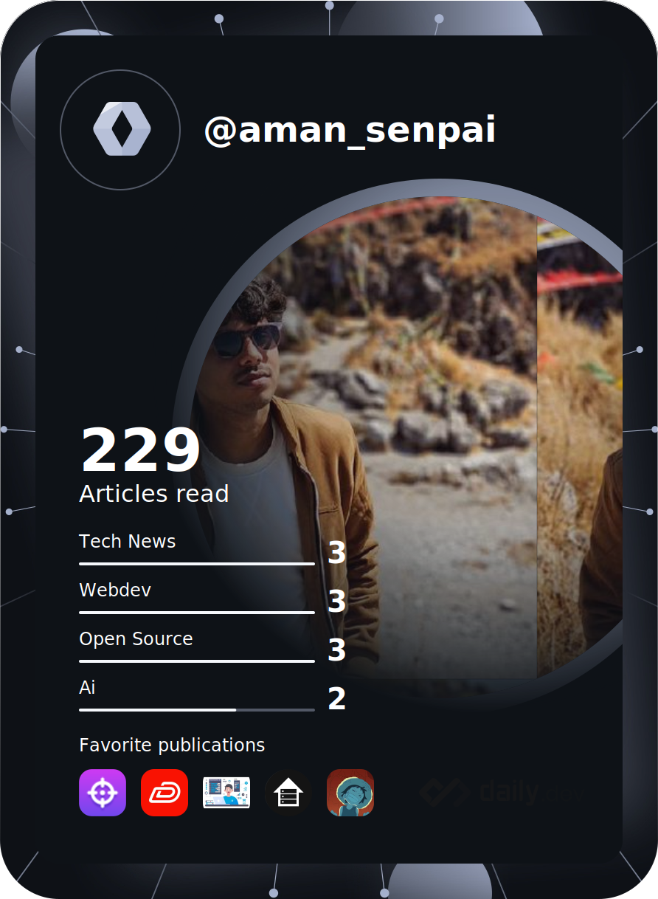

[](https://www.github.com/aman-senpai)


<!--  -->

# Namaste, I'm Aman. 
### A proficient Web Developer, Designer, and Architect. 
I stand as a seasoned Software Engineer. My repertoire is enriched with expertise in the realms of Full Stack Web Development, Design, and Architectural prowess.



- 📍 Based in India.
- 🌏 Explore my professional portfolio at [this serene destination](https://senpai-notes-d95b.vercel.app/). 🏯
- 📧 You can contact me at [jemscollin1@gmail.com](mailto:jemscollin1@gmail.com). ✉️
- 🧠 Currently, I am passionately delving into the realm of Microservices, expanding my knowledge and skills. 📚
- 🤝 I am eagerly looking forward to the opportunity to collaborate on **MERN** projects and exciting ventures in the Microservices domain. 💼
- ⚡ Fueled by a fervent passion for technology and an undeniable love for anime, I proudly identify as a tech enthusiast and a devoted Weeb. 🤖🍃
- ⛩️ I tries my best to live by Samurai code </> 

### *I Wissssh! Life was this easy 👇 >_<*

```javascript
const request = await fetch("http://calllog/senpai.json", {
  method: "GET",
  headers: {
    // Headers here...
  }
});

const callLog = await request.json();

/**
 * @param {Array} callLog - List of people to call, who are {@link realPeople}
 * @returns {Promise} - A promise for a callback.
 */
async function makeCalls(callLog) {
  try {
    for (const person of callLog) {
      // Make a call, please. I don't have the energy.
      await handleCall(person);
    }
  } catch (error) {
    console.error("Error making calls:", error);
  }
}

await makeCalls(callLog);

```

<div align="center">


### Skills

<p>
  <a href="https://git-scm.com/" target="_blank" rel="noreferrer">
    
  </a>
  <a href="https://www.oracle.com/java/" target="_blank" rel="noreferrer">
    
  </a>
  <a href="https://developer.mozilla.org/en-US/docs/Web/JavaScript" target="_blank" rel="noreferrer">
    
  </a>
  <a href="https://www.python.org/" target="_blank" rel="noreferrer">
    
  </a>
  <a href="https://www.typescriptlang.org/" target="_blank" rel="noreferrer">
    
  </a>
  <a href="https://developer.mozilla.org/en-US/docs/Glossary/HTML5" target="_blank" rel="noreferrer">
    
  </a>
  <a href="https://reactjs.org/" target="_blank" rel="noreferrer">
    
  </a>
  <a href="https://nextjs.org/docs" target="_blank" rel="noreferrer">
    
  </a>
  <a href="https://www.w3.org/TR/CSS/#css" target="_blank" rel="noreferrer">
    
  </a>
  <a href="https://tailwindcss.com/" target="_blank" rel="noreferrer">
    
  </a>
  <a href="https://getbootstrap.com/" target="_blank" rel="noreferrer">
    
  </a>
  <a href="https://vitejs.dev/" target="_blank" rel="noreferrer">
    
  </a>
  <a href="https://redux.js.org/" target="_blank" rel="noreferrer">
    
  <br/>
  <a href="https://babeljs.io/" target="_blank" rel="noreferrer">
    
  </a>
  <a href="https://nodejs.org/en/" target="_blank" rel="noreferrer">
    
  </a>
  <a href="https://expressjs.com/" target="_blank" rel="noreferrer">
    
  </a>
  </a>
  <a href="https://www.mongodb.com/" target="_blank" rel="noreferrer">
    
  </a>
  <a href="https://supabase.io/" target="_blank" rel="noreferrer">
    
  </a>
  <a href="https://firebase.google.com/" target="_blank" rel="noreferrer">
    
  </a>
  <a href="https://www.postgresql.org/" target="_blank" rel="noreferrer">
    
  </a>
  <a href="https://www.mysql.com/" target="_blank" rel="noreferrer">
    
  </a>
  <a href="https://aws.amazon.com" target="_blank" rel="noreferrer">
    
  </a>
  <a href="https://www.docker.com/" target="_blank" rel="noreferrer">
    
  </a>
  <a href="https://www.linux.org" target="_blank" rel="noreferrer">
    
  </a>
  <a href="https://www.figma.com/" target="_blank" rel="noreferrer">
    
  </a>
  <a href="https://metamask.io/" target="_blank" rel="noreferrer">
    
  </a>
  <a href="https://cloud.google.com/" target="_blank" rel="noreferrer">
    
  </a>
</p>


## Socials

<p>
  <a href="https://www.github.com/aman-senpai" target="_blank" rel="noreferrer">
    
  </a>
  <a href="http://www.instagram.com/aman.senpai" target="_blank" rel="noreferrer">
    
  </a>
  <a href="https://www.linkedin.com/in/aman-senpai" target="_blank" rel="noreferrer">
    
  </a>
  <a href="https://www.x.com/AmanSenpai" target="_blank" rel="noreferrer">
    
  </a>
</p>


## My Stats
<a href="http://www.github.com/aman-senpai">
  
</a>
<br />

[](https://github.com/ashutosh00710/github-readme-activity-graph)<div/>
